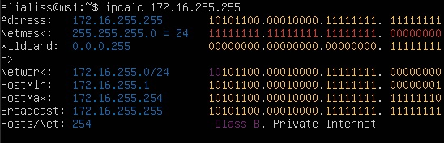
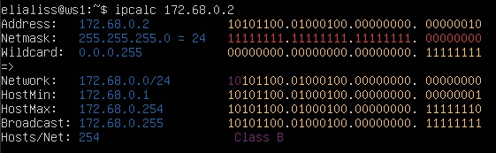
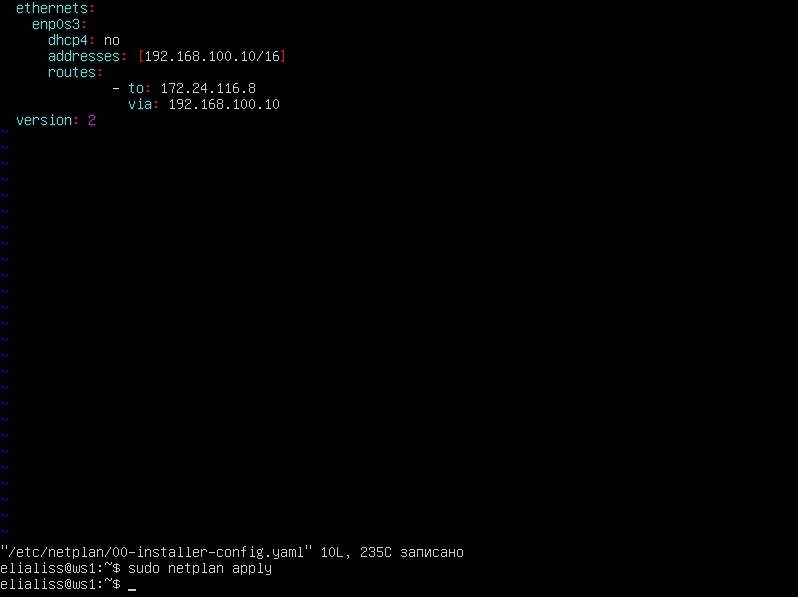
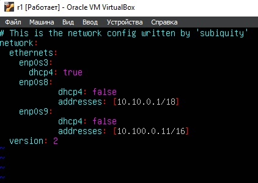
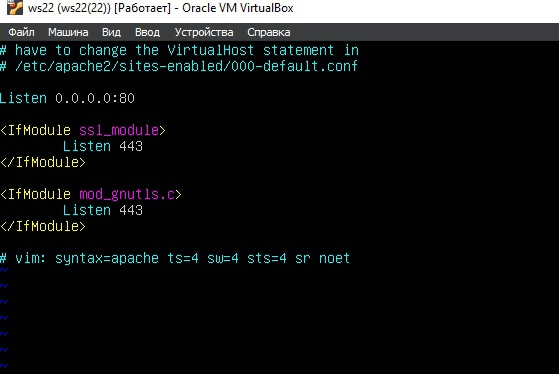

## Part 1. Инструмент **ipcalc**

#### 1.1. Сети и маски
##### Определить и записать в отчёт:
##### 1) адрес сети *192.167.38.54/13*
- вводим команду ``ipcalc 192.167.38.54/13`` получаем информацию об адресе сети:


##### 2) перевод маски *255.255.255.0* в префиксную и двоичную запись, */15* в обычную и двоичную, *11111111.11111111.11111111.11110000* в обычную и префиксную

- перевод маски *255.255.255.0* в префиксную и двоичную запись ``ipcalc 255.255.255.0``:


- перевод маски */15* в обычную и двоичную ``ipcalc /15``:


- перевод *11111111.11111111.11111111.11110000* в обычную и префиксную ``ipcalc 11111111.11111111.11111111.11110000``:


##### 3) минимальный и максимальный хост в сети *12.167.38.4* при масках: */8*, *11111111.11111111.00000000.00000000*, *255.255.254.0* и */4*

- минимальный и максимальный хост в сети *12.167.38.4/8* ``ipcalc 12.167.38.4/8``:


- минимальный и максимальный хост в сети *12.167.38.4/11111111.11111111.00000000.00000000* ``ipcalc 12.167.38.4/11111111.11111111.00000000.00000000``:


- минимальный и максимальный хост в сети *12.167.38.4/255.255.254.0* ``ipcalc 12.167.38.4/255.255.254.0``:


- минимальный и максимальный хост в сети *12.167.38.4/4* ``ipcalc 12.167.38.4/4``:


#### 1.2. localhost
##### Определить и записать в отчёт, можно ли обратиться к приложению, работающему на localhost, со следующими IP: *194.34.23.100*, *127.0.0.2*, *127.1.0.1*, *128.0.0.1*

- localhost — в компьютерных сетях, стандартное, официально зарезервированное доменное имя для частных IP-адресов (в диапазоне 127.0.0.1 — 127.255.255.254), который устанавливается на специальный сетевой интерфейс «внутренней петли» (англ. loopback)

- Проверка IP *194.34.23.100* ``ipcalc 194.34.23.100`` (не подходит):


- Проверка IP *127.0.0.2* ``ipcalc 127.0.0.2`` (подходит):


- Проверка IP *128.0.0.1* ``ipcalc 128.0.0.1`` (не подходит):


- Проверка IP *127.1.0.1* ``ipcalc 127.1.0.1`` (подходит):


#### 1.3. Диапазоны и сегменты сетей
##### Определить и записать в отчёт:
##### 1) какие из перечисленных IP можно использовать в качестве публичного, а какие только в качестве частных: *10.0.0.45*, *134.43.0.2*, *192.168.4.2*, *172.20.250.4*, *172.0.2.1*, *192.172.0.1*, *172.68.0.2*, *172.16.255.255*, *10.10.10.10*, *192.169.168.1*

- к частным относятся следующие IP адреса: 10.0.0.45, 192.168.4.2, 172.20.250.4, 172.16.255.255, 10.10.10.10:





- к публичным относятся следующие IP адреса: 134.43.0.2, 172.0.2.1, 192.172.0.1, 172.68.0.2, 192.169.168.1





##### 2) какие из перечисленных IP адресов шлюза возможны у сети *10.10.0.0/18*: *10.0.0.1*, *10.10.0.2*, *10.10.10.10*, *10.10.100.1*, *10.10.1.255*

- Смотрим значения ``HostMin`` и ``HostMax``, доступны: 
  - 10.10.0.2
  - 10.10.10.10
  - 10.10.1.255


## Part 2. Статическая маршрутизация между двумя машинами

##### Поднять две виртуальные машины (далее -- ws1 и ws2):


##### С помощью команды `ip a` посмотреть существующие сетевые интерфейсы:


##### Описать сетевой интерфейс, соответствующий внутренней сети, на обеих машинах и задать следующие адреса и маски: ws1 - *192.168.100.10*, маска */16*, ws2 - *172.24.116.8*, маска */12*

- Изменяем файл *etc/netplan/00-installer-config.yaml* для каждой машины:

- ws1


сразу Выполняем команду `netplan apply` для перезапуска сервиса сети:

- ws2


сразу Выполняем команду `netplan apply` для перезапуска сервиса сети:


#### 2.1. Добавление статического маршрута вручную
##### Добавить статический маршрут от одной машины до другой и обратно при помощи команды вида `ip r add`:

- ws1


- ws2


##### Пропинговать соединение между машинами

- ws1


- ws2


#### 2.2. Добавление статического маршрута с сохранением

- Перезапускаем машины

##### Добавить статический маршрут от одной машины до другой с помощью файла *etc/netplan/00-installer-config.yaml*

- ws1



- ws2


##### Пропинговать соединение между машинами

- ws1


- ws2


## Part 3. Утилита **iperf3**

#### 3.1. Скорость соединения
##### Перевести и записать в отчёт: 8 Mbps в MB/s, 100 MB/s в Kbps, 1 Gbps в Mbps

- 8 Mbps = 1 MB/s  
- 100 MB/s = 819200 Kbps  
- 1 Gbps = 1024 Mbps

#### 3.2. Утилита **iperf3**
##### Измерить скорость соединения между ws1 и ws2

- Запускаем ws1 в качестве сервера: 


- Запускаем ws2 в качестве клиента: 


## Part 4. Сетевой экран

#### 4.1. Утилита **iptables**
##### Создать файл */etc/firewall.sh*, имитирующий фаерволл, на ws1 и ws2:
##### Нужно добавить в файл подряд следующие правила:
##### 1) на ws1 применить стратегию когда в начале пишется запрещающее правило, а в конце пишется разрешающее правило (это касается пунктов 4 и 5)
##### 2) на ws2 применить стратегию когда в начале пишется разрешающее правило, а в конце пишется запрещающее правило (это касается пунктов 4 и 5)
##### 3) открыть на машинах доступ для порта 22 (ssh) и порта 80 (http)
##### 4) запретить *echo reply* (машина не должна "пинговаться”, т.е. должна быть блокировка на OUTPUT)
##### 5) разрешить *echo reply* (машина должна "пинговаться")
- ws1 в начале пишется запрещающее правило, а в конце пишется разрешающее правило, открываем порты 22 и 80


- ws2 в начале пишется разрешающее правило, а в конце пишется запрещающее правило, открываем порты 22 и 80


##### Запустить файлы на обеих машинах командами `chmod +x /etc/firewall.sh` и `/etc/firewall.sh`


- Разница между стратегиями заключается в том, что в первом файле первым подходящим правилом для пакета является запрет, а во втором - разрешение. Применяется только первое подходящее правило, остальные игнорируются.

#### 4.2. Утилита **nmap**
##### Командой **ping** найти машину, которая не "пингуется", после чего утилитой **nmap** показать, что хост машины запущен

 - ping с ws1 на ws2


 - ping с ws2 на ws1
 


 - nmap


## Part 5. Статическая маршрутизация сети

##### Поднять пять виртуальных машин (3 рабочие станции (ws11, ws21, ws22) и 2 роутера (r1, r2))


#### 5.1. Настройка адресов машин
##### Настроить конфигурации машин в *etc/netplan/00-installer-config.yaml* согласно сети на рисунке.

- ws11


- ws21


- ws22


- r1



- r2


##### Перезапустить сервис сети. Если ошибок нет, то командой `ip -4 a` проверить, что адрес машины задан верно. Также пропинговать ws22 с ws21. Аналогично пропинговать r1 с ws11.

- Для всех машин выполняем ``sudo netplan apply``

- ws11


- ws21


- ws22


- r1


- r2


- ping ws22 с ws21 и r1 c ws11


#### 5.2. Включение переадресации IP-адресов.
##### Для включения переадресации IP, выполните команду на роутерах:
`sysctl -w net.ipv4.ip_forward=1`
*При таком подходе переадресация не будет работать после перезагрузки системы.*

- r1


- r2


##### Откройте файл */etc/sysctl.conf* и добавьте в него следующую строку:
`net.ipv4.ip_forward = 1`
*При использовании этого подхода, IP-переадресация включена на постоянной основе.*

- r1


- r2


#### 5.3. Установка маршрута по-умолчанию
Пример вывода команды `ip r` после добавления шлюза:
```
default via 10.10.0.1 dev eth0
10.10.0.0/18 dev eth0 proto kernel scope link src 10.10.0.2
```
##### Настроить маршрут по-умолчанию (шлюз) для рабочих станций. Для этого добавить `default` перед IP роутера в файле конфигураций

- ws11


- ws21


- ws22


##### Вызвать `ip r` и показать, что добавился маршрут в таблицу маршрутизации

- ws11


- ws21


- ws22


##### Пропинговать с ws11 роутер r2 и показать на r2, что пинг доходит. Для этого использовать команду:
`tcpdump -tn -i eth1`

- пингуем с ws11, проверяем с помощью tcpdump -tn -i eth1


#### 5.4. Добавление статических маршрутов
##### Добавить в роутеры r1 и r2 статические маршруты в файле конфигураций. Пример для r1 маршрута в сетку 10.20.0.0/26:

- Cтатические маршруты для r1 и r2 


##### Вызвать `ip r` и показать таблицы с маршрутами на обоих роутерах. Пример таблицы на r1:
```
10.100.0.0/16 dev eth1 proto kernel scope link src 10.100.0.11
10.20.0.0/26 via 10.100.0.12 dev eth1
10.10.0.0/18 dev eth0 proto kernel scope link src 10.10.0.1
```
- Вызов `ip r` для r1 и r2


##### Запустить команды на ws11:
`ip r list 10.10.0.0/[маска сети]` и `ip r list 0.0.0.0/0`


- Маршруты, которые более точно соответствуют целевому IP-адресу, имеют более высокий приоритет. Если есть маршрут для конкретной подсети, он будте иметь более высокий приоритет, чем маршрут по умолчанию


#### 5.5. Построение списка маршрутизаторов


##### Запустить на r1 команду дампа:
`tcpdump -tnv -i eth0`


##### При помощи утилиты **traceroute** построить список маршрутизаторов на пути от ws11 до ws21
- Вызов и вывод traceroute на ws11


- Вызов и вывод tcpdump -tnv -i enp0s9 на r1


- Принцип построения пути при помощи traceroute:  
Для определения промежуточных маршрутизаторов traceroute отправляет серию пакетов данных целевому узлу, при этом каждый раз увеличивая на 1 значение поля TTL («время жизни»). Это поле обычно указывает максимальное количество маршрутизаторов, которое может быть пройдено пакетом. Первый пакет отправляется с TTL, равным 1, и поэтому первый же маршрутизатор возвращает обратно сообщение ICMP, указывающее на невозможность доставки данных. Traceroute фиксирует адрес маршрутизатора, а также время между отправкой пакета и получением ответа. Затем traceroute повторяет отправку пакета, но уже с TTL, равным 2, что позволяет первому маршрутизатору пропустить пакет дальше.  
Процесс повторяется до тех пор, пока при определённом значении TTL пакет не достигнет целевого узла. При получении ответа от этого узла процесс трассировки считается завершённым.

#### 5.6. Использование протокола **ICMP** при маршрутизации
##### Запустить на r1 перехват сетевого трафика, проходящего через eth0 с помощью команды:
`tcpdump -n -i enp0s8 icmp`


##### Пропинговать с ws11 несуществующий IP (например, *10.30.0.111*) с помощью команды:
`ping -c 1 10.30.0.111`


## Part 6. Динамическая настройка IP с помощью **DHCP**

##### Для r2 настроить в файле */etc/dhcp/dhcpd.conf* конфигурацию службы **DHCP**:
##### 1) указать адрес маршрутизатора по-умолчанию, DNS-сервер и адрес внутренней сети. Пример файла для r2:

- Вношу изменения в файл /etc/dhcp/dhcpd.conf


##### 2) в файле *resolv.conf* прописать `nameserver 8.8.8.8.`


##### Перезагрузить службу **DHCP** командой `systemctl restart isc-dhcp-server`. Машину ws21 перезагрузить при помощи `reboot` и через `ip a` показать, что она получила адрес. Также пропинговать ws22 с ws21.

- Перезагружаем службу DHCP(cкрин выше)

- Перезагружаю ws21 с помощью команды `sudo reboot` и вызываю команду `ip a` (ip получен)


- Пинг ws22 с ws21


##### Указать MAC адрес у ws11, для этого в *etc/netplan/00-installer-config.yaml* надо добавить строки: `macaddress: 10:10:10:10:10:BA`, `dhcp4: true`. Так же меняем MAC в настройках VB для ws11.


##### Для r1 настроить аналогично r2, но сделать выдачу адресов с жесткой привязкой к MAC-адресу (ws11). Провести аналогичные тесты

- Вношу изменения в файл /etc/dhcp/dhcpd.conf


- Редактируем файл /etc/resolv.conf и перезагружаем службу DHCP


- Перезагружаю ws11 с помощью команды sudo reboot и вызываю команду ip a (ip получен)


- Пинг ws22 с ws11


##### Запросить с ws21 обновление ip адреса

- Проверяем IP до обновления


- Запросим с ws21 обновление ip адреса с помощью команды ``sudo dhclient -v``
    - v - будет выведена дополнительная информация.


- Проверяем IP после обновления


- В части 6 были использованы следующие опции DHCP протокола:

  - option routers ip-address [, ip-address...]; - адрес шлюзов для клиентской сети. Маршрутизаторы должны быт перечислены в порядке предпочтительности.

  - option domain-name-servers ip-address [
  ip-address...]; - Список DNS серверов доступны клиенту. Сервера должны быть перечислены в порядок предпочтительности.

## Part 7. **NAT**
`-` Ну и, наконец, в качестве вишенки на торте, я расскажу тебе про механизм преобразования адресов.

**== Задание ==**

*В данном задании используются виртуальные машины из Части 5*
##### В файле */etc/apache2/ports.conf* на ws22 и r1 изменить строку `Listen 80` на `Listen 0.0.0.0:80`, то есть сделать сервер Apache2 общедоступным

- Для ws22 и r1 меняем `Listen 80` на `Listen 0.0.0.0:80`





##### Запустить веб-сервер Apache командой `service apache2 start` на ws22 и r1

- Запускаем веб-сервер Apache для r1


- Запускаем веб-сервер Apache для ws22

!7.4.jpg](7.4.jpg)

##### Добавить в фаервол, созданный по аналогии с фаерволом из Части 4, на r2 следующие правила:
##### 1) удаление правил в таблице filter - `iptables -F`
##### 2) удаление правил в таблице "NAT" - `iptables -F -t nat`
##### 3) отбрасывать все маршрутизируемые пакеты - `iptables --policy FORWARD DROP`


##### Запускать файл также, как в Части 4


##### Проверить соединение между ws22 и r1 командой `ping`
*При запуске файла с этими правилами, ws22 не должна "пинговаться" с r1*


##### Добавить в файл ещё одно правило:
##### 4) разрешить маршрутизацию всех пакетов протокола **ICMP**


##### Запускать файл также, как в Части 4


##### Проверить соединение между ws22 и r1 командой `ping`
*При запуске файла с этими правилами, ws22 должна "пинговаться" с r1*


##### Добавить в файл ещё два правила:
##### 5) включить **SNAT**, а именно маскирование всех локальных ip из локальной сети, находящейся за r2 (по обозначениям из Части 5 - сеть 10.20.0.0)
##### 6) включить **DNAT** на 8080 порт машины r2 и добавить к веб-серверу Apache, запущенному на ws22, доступ извне сети


##### Запускать файл также, как в Части 4


##### Проверить соединение по TCP для **SNAT**, для этого с ws22 подключиться к серверу Apache на r1 командой:
`telnet [адрес] [порт]`

- Подключаемся через telnet, после пингуем с ws22 r1 для проверки


- На r1 проверяем что произрошла подмена ip ws22 на адресс r2. 


##### Проверить соединение по TCP для **DNAT**, для этого с r1 подключиться к серверу Apache на ws22 командой `telnet` (обращаться по адресу r2 и порту 8080)

- Подключаемся через telnet, после пингуем с r1 ws22 для проверки


- На ws22 проверяем что запрос поступил от ip r1 


## Part 8. Дополнительно. Знакомство с **SSH Tunnels**

##### Запустить на r2 фаервол с правилами из Части 7


##### Запустить веб-сервер **Apache** на ws22 только на localhost (то есть в файле */etc/apache2/ports.conf* изменить строку `Listen 80` на `Listen localhost:80`)


- Запускаем веб-сервер **Apache** на ws22


##### Воспользоваться *Local TCP forwarding* с ws21 до ws22, чтобы получить доступ к веб-серверу на ws22 с ws21

- Создаём соединение. Получаем доступ к ws22 с ws21


- Проверка при помощи `telnet 127.0.0.1 [локальный порт]`


##### Воспользоваться *Remote TCP forwarding* c ws11 до ws22, чтобы получить доступ к веб-серверу на ws22 с ws11

- *Remote TCP forwarding* получаем доступ с ws22 на ws11, хоть и был пробрешен туннель, который с виду работает, в действительности возможности после этих действий подключиьтся с ws11 к ws22 у меня нет. Ниже приложены скрины с командами и проверкой наличия тунеляю


 


